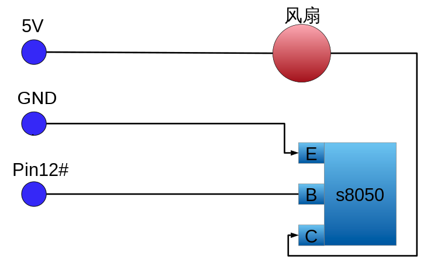

# Connect the fan according to the schematic


# config raspberrypi
add to config.txt
```
dtoverlay=pwm

dtoverlay=pwm-2chan
```
then

```
reboot
```

# install
```
sh install.sh
```

```
sudo systemctl status pwm-fan
```

# uninstall
```
sh uninstall.sh
```