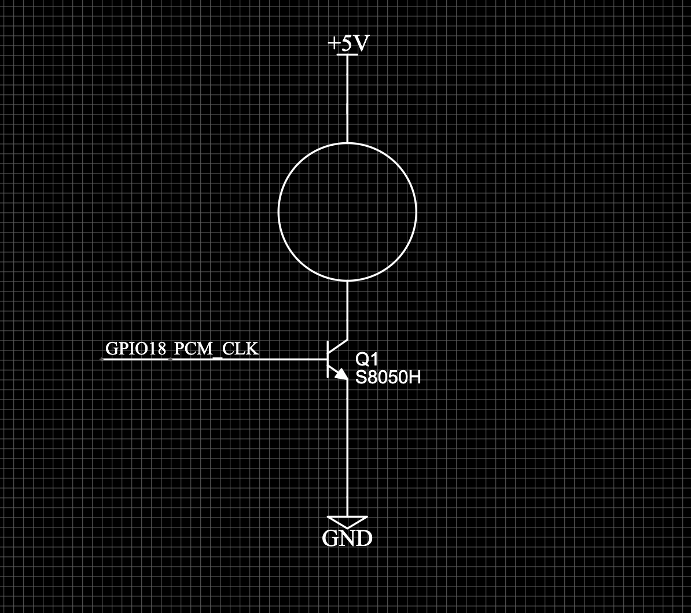

support raspberrypi 4 vie ubuntu or raspbian
support raspberrypi 3b+ vie ubuntu or raspbian

# Connect the fan according to the schematic



# config raspberrypi
add to config.txt
```
dtoverlay=pwm

dtoverlay=pwm-2chan
```
then

```
reboot
```

after reboot, export pwm0

```
sudo sh -c "echo 0 > /sys/class/pwm/pwmchip0/export"
```

# install

```
docker run \
  --log-driver json-file \
  --log-opt max-size=10m \
  -d \
  hellobit/raspberrypi-pwm-fan
```

# default config
start fan at 50 on 80%  duty_cycle
stop  fan at 45
start fan at 60 on 100% duty_cycle

# check temperature
```
cat /sys/class/thermal/thermal_zone0/temp
```

# check duty_cycle
```
cat /sys/class/pwm/pwmchip0/pwm0/duty_cycle
```